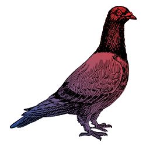

# Nikola's Projects 

This repository contains a collection of my projects (done for professional purposes or just for fun and education). Navigate to any of the links to learn more about the project, view the source code, or read the corresponding blog posts.

For more information about my professional projects, see my homepage: www.nikola-sur.com and https://github.com/Julia-Tempering/Pigeons.jl. 

## Professional Project - "Pigeons: Distributed Sampling from Intractable Distributions"
*Link: https://github.com/Julia-Tempering/Pigeons.jl* 

I am a core contributor of the Pigeons project, a Julia package for distributed sampling from intractable distribution on up to 1,000s of MPI-communicating machines. A Python interface for the package is currently in progress. The package is used by numerous astrophysicists and scientists around the world, such as at the Event Horizon Telescope and Harvard University.

  

  

## Professional Projects - Assorted Research Papers 

Learn more about my research at www.nikola-sur.com. 

## Personal Project - "Twenty Questions Against AI"

Play the classic guessing game against AI. You can choose to have the AI guess your object or try to guess the AI's chosen object. Custom themes/topics are also possible.

Click here to learn more.

**Skills**: 
- LLM prompting
- OpenAI API and model calls
- Javascript, HTML, CSS
- App deployment

## Knowledge Graph 

## S

## Google ADK
