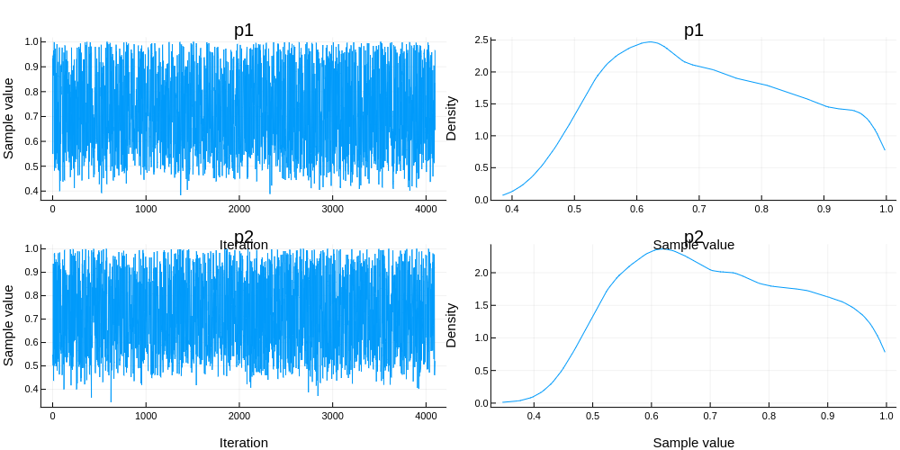

# Nikola's Projects 

This repository contains a collection of my projects (done for professional purposes or just for fun and education). Navigate to any of the links to learn more about the project, view the source code, or read the corresponding blog posts.

For more information about my professional projects, see my homepage: www.nikola-sur.com and https://github.com/Julia-Tempering/Pigeons.jl. 

## Professional Project - "Pigeons: Distributed Sampling from Intractable Distributions"
*Link: https://github.com/Julia-Tempering/Pigeons.jl* 

I am a core contributor of the Pigeons project, a Julia package for distributed sampling from intractable distribution on up to 1,000s of MPI-communicating machines. A Python interface for the package is currently in progress. The package is used by numerous astrophysicists and scientists around the world, such as at the Event Horizon Telescope and Harvard University.

  

  

## Professional Project - Machine Learning and Gen AI at Amazon 

I developed ML models and agentic workflows at Amazon during my internship as an Applied Scientist in Bellevue, WA on the Supply Chain Optimization Technologies team. Amazon operates one of the world's largest supply chains and machine learning models have a direct impact on the experience of millions of customers on a daily basis.

## Professional Projects - Assorted Research Papers 

Learn more about my research at www.nikola-sur.com. Research papers I have authored/co-authored have been published in top machine learning and statistics venues, such as: 
- Neural Information Processing Systems (NeurIPS)
- International Conference on Machine Learning (ICML)
- Artificial Intelligence and Statistics (AISTATS)

I have done work on: 
- Scalable uncertainty quantification for machine learning with Bayesian inference
- Variational inference
- Markov chain Monte Carlo (adaptive and tempering methods)
- Computational statistics applied to problems in astrophysics
- Statistical theory and goodness-of-fit testing

## Personal Project - "Twenty Questions Against AI"
*Link: https://github.com/nikola-sur/twenty-questions*

Play the classic guessing game against AI. You can choose to have the AI guess your object or try to guess the AI's chosen object. Custom themes/topics are also possible.

**Skills**: 
- LLM prompting
- OpenAI API and model calls
- Javascript, HTML, CSS
- App deployment

## Personal Project - "Time Architect" 
*Link: https://github.com/nikola-sur/time-architect* 

**Skills:** 
- Google Agent Development Kit
- Amazon Web Services (EC2, S3, Lambda, etc.)
- Database storage
- LLM prompting

## Personal Project - "Knowledge Graph"

## S

